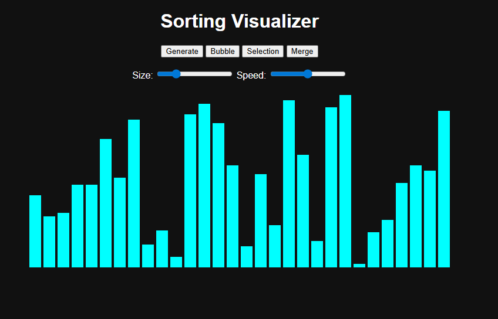
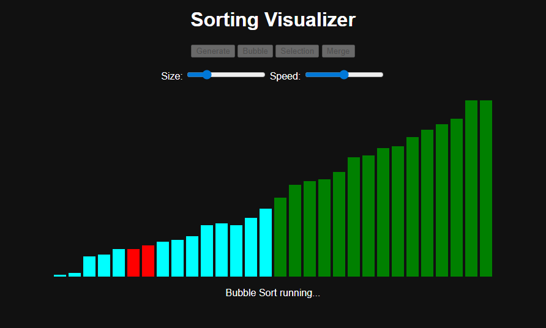

# Sorting Algorithm Visualizer

## Overview

This project is a web-based Sorting Algorithm Visualizer built using HTML, CSS, and JavaScript.
It helps in understanding how different sorting algorithms work by visualizing them step-by-step.

---

## Features

* Generate random array of bars
* Adjust array size using slider
* Adjust sorting speed
* Visualize sorting step-by-step
* Color-coded animations:

  * 🔴 Red → Comparing elements
  * 🟡 Yellow → Current element
  * 🟢 Green → Sorted elements

---

## Algorithms Implemented

### 1. Bubble Sort

* Compares adjacent elements
* Swaps if they are in wrong order
* Time Complexity: **O(n²)**

### 2. Selection Sort

* Finds minimum element and places it correctly
* Time Complexity: **O(n²)**

### 3. Merge Sort

* Uses divide and conquer technique
* Recursively splits array and merges
* Time Complexity: **O(n log n)**

---

## Technologies Used

* HTML
* CSS
* JavaScript (DOM Manipulation, Async/Await)

---

## How to Run

1. Download or clone the repository
2. Open `index.html` in your browser

---

## Project Preview

---

## What I Learned

* How sorting algorithms work internally
* Difference between iterative and recursive approaches
* DOM manipulation using JavaScript
* Handling asynchronous animations using `async/await`

---

## Future Improvements

* Add more algorithms (Quick Sort, Heap Sort)
* Improve Merge Sort animation
* Add performance comparison graphs
* Add pause/resume functionality

---

## Purpose of Project

This project was built to strengthen my understanding of Data Structures and Algorithms and to visualize how sorting algorithms behave in real-time.

---
